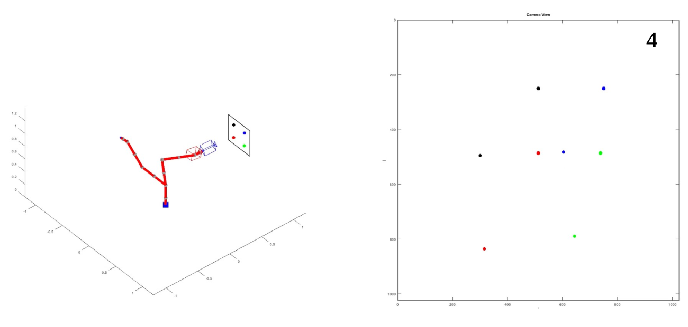

# KUKA Robot Visual Servoing Simulation

This project implements a simulation of image-based visual servoing (IBVS) for a 7-DOF KUKA robotic manipulator equipped with a fixed camera on the end-effector. The robot uses visual feedback from a known pattern in the workspace to align its camera with a desired target pose.

## Features

- Simulates camera-in-hand visual servoing
- Implements dual quaternion kinematics for robot pose representation
- Uses a 3D pattern and projects it into image space via camera intrinsics
- Real-time visual feedback control using the interaction matrix (image Jacobian)
- Plots 3D robot and camera poses as well as image plane tracking
- Logs and visualizes error norm over time

## Dependencies

- MATLAB (tested with R2021a+)
- Robotics Toolbox for MATLAB (optional, depending on your implementation)
- Custom function files (see below)

## File Structure

- `main.m` — Main simulation script (the one shown above)
- `fkm.m` — Forward kinematics function returning end-effector pose as a dual quaternion
- `uthetat2dq.m` — Converts axis-angle and translation to dual quaternion
- `dualq2uthetaRt.m` — Converts dual quaternion to axis-angle and transformation matrix
- `put_pattern.m` — Generates 3D pattern points in world space
- `take_image.m` — Projects 3D points to 2D using camera intrinsics
- `pattern_pix2metric.m` — Converts pixel coordinates to metric coordinates
- `image_jacobian_4points.m` — Computes interaction matrix for 4 points
- `jacobian.m` — Robot geometric Jacobian
- `plot_kuka_robot.m` — Visualizes the KUKA robot
- `plot_camera.m` — Plots camera frustum and pose
- `plot_pattern.m` — Plots the 3D pattern

## How to Run

1. Ensure all function files are available in the MATLAB path.
2. Open `main.m`.
3. Run the script.

You will see:
- A 3D visualization of the KUKA robot, camera, and pattern.
- The current vs. desired image of the pattern.
- A plot of the visual error over time.

## Parameters

- `q_init` — Initial joint configuration
- `X_BR` — Desired pose of the end-effector
- `X_CR` — Pose of the 3D pattern in world space
- `K` — Camera intrinsic matrix
- `tf`, `dt` — Total time and step size for the simulation loop

## License

This project is for educational and research purposes only.

---

